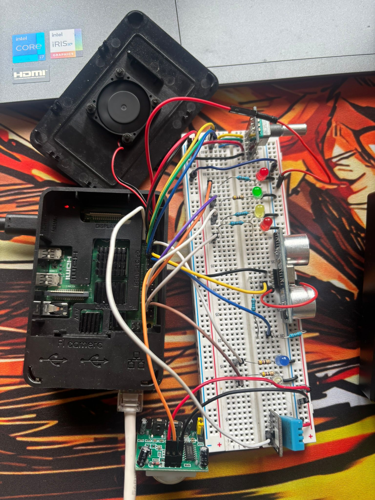

# Monitorización y Seguridad IoT para Vehículos

Proyecto IoT orientado a la monitorización y seguridad de un vehículo simulado, combinando **Raspberry Pi**, **sensores físicos**, **RabbitMQ** y un **backend en Java** para procesar telemetría en tiempo real.

Este sistema permite capturar eventos del entorno, enviar datos desde el hardware a un backend y dejar preparada una base para futuras respuestas automáticas de seguridad.

---

## Vista real del proyecto

### Montaje sobre protoboard




## ¿Qué hace este proyecto?

El sistema simula la parte electrónica e inteligente de un vehículo conectado.

Entre sus funciones principales están:

- lectura de sensores físicos desde una Raspberry Pi,
- detección de eventos como proximidad, movimiento o cambios de temperatura,
- activación de indicadores visuales mediante LEDs,
- envío de telemetría en formato JSON,
- comunicación asíncrona con RabbitMQ,
- procesamiento de datos desde un backend Java,
- registro persistente de eventos mediante logs.

---

## Tecnologías utilizadas

### Hardware

- Raspberry Pi 5
- Protoboard
- LEDs y resistencias
- HC-SR04
- HC-SR501
- DHT11
- MLX90614
- KY-040

### Software

- Python
- Java
- RabbitMQ
- Maven
- Docker
- Logback
- SLF4J
- Fritzing

---

## Estructura del proyecto

```text
vehicle-sensors/
├── hardware/
│   ├── core/
│   ├── messaging/
│   ├── sensors/
│   └── main.py
│
├── src/main/
│   ├── java/
│   └── resources/
│
├── Dockerfile
├── docker-compose.yml
├── pom.xml
└── logs/
```

---

## Cómo ejecutar el proyecto

### 1. Preparar el entorno Python en la Raspberry Pi

```bash
python3 -m venv venv
source venv/bin/activate
pip install -r requirements.txt
```

### 2. Compilar el backend Java

```bash
mvn clean package
```

### 3. Levantar RabbitMQ y el backend con Docker

```bash
docker compose up --build -d
```

### 4. Ejecutar la parte hardware

```bash
python3 hardware/main.py
```

---

## Ejecución del sistema

El flujo general del proyecto es el siguiente:

1. La Raspberry Pi lee los sensores conectados al sistema.
2. Cuando ocurre un evento, se actualiza el estado del vehículo.
3. La telemetría se envía a RabbitMQ en formato JSON.
4. El backend Java consume esos mensajes.
5. Los eventos relevantes se procesan y se registran en logs.

---

## Estado actual

Actualmente el proyecto incluye:

- integración base del hardware,
- lectura de sensores,
- indicadores visuales,
- envío de telemetría,
- backend consumidor en Java,
- contenedorización con Docker,
- persistencia de logs.

---

## Mejoras futuras

- recepción de órdenes desde el backend hacia el vehículo,
- integración de pantalla LCD/OLED,
- motor DC para simular aceleración y frenado,
- mejoras de seguridad sobre la comunicación,
- ampliación de la lógica de respuesta ante eventos críticos.

---

Proyecto desarrollado como práctica de integración entre **hardware**, **programación**, **mensajería distribuida** y **backend** en un entorno IoT.
